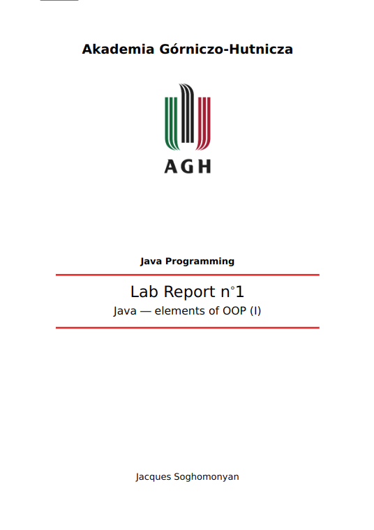

# report_card_template

Personal Report card for my lab reports (now using LaTeX3).\
\
The template is made for the courses that I follow. Thus, it probably isn't suited for everybody, but don't worry.

It has hard coded courses with custom color themes. But you can setup your own by overriding the `documentclass` [parameters](./efrei_report_card.cls#L18):
```latex
\documentclass[
    name={Custom Name},
    color=ff0000,
    title={Custom Title},
    subtitle={Subtitle}
]{efrei_report_card}
```
The **theme** color is a base from which the header and background color of the `\question[]{}{}` directive are derived.

To change the logo you must tinker with the code mainly [here](./efrei_report_card.cls#L147)

This class offers 2 directives:
* `\exercise[]{}{}`
* `\question[]{}{}`


`\exercise[number_override]{title}{content}` Is represents an exercise, it has its own counter. This counter will increment without specifying. But you can override the number.

`\question[number_override]{title}{content}` Is represents a question of an exercise, it has its own counter. This counter will increment without specifying. But you can override the number.

```latex
\exercise{Title}{% => 1 --- Title
    \question{subtitle}{% => 1.1 subtitle
        \(a=b\)
    }

    \question[6]{subtitle6}{% => 1.6 subtitle6
        \(a=b\)
    }
}

\exercise{the second}{% => 2 --- the second
}

\exercise[5]{the fifth}{% => 5 --- the fifth
}
```

### THIS IS MY FIRST TIME MAKING A LATEX CLASS, IT IS PROBABLY DOG WATER. 
(it uses the `arev` font by default)
